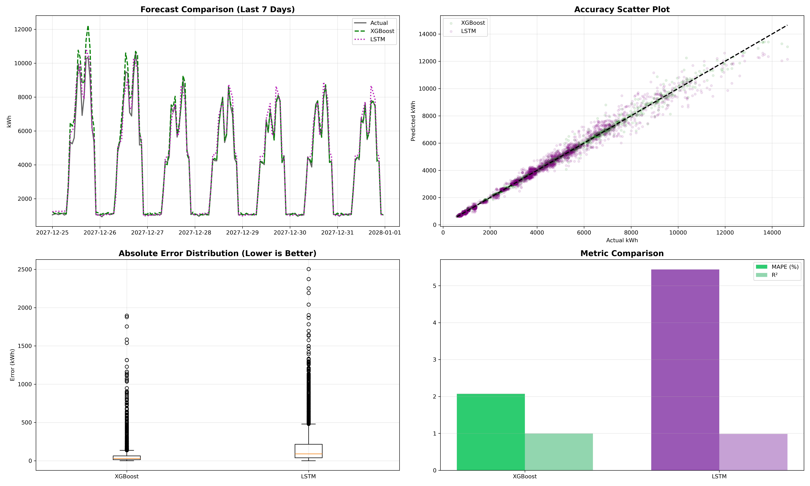
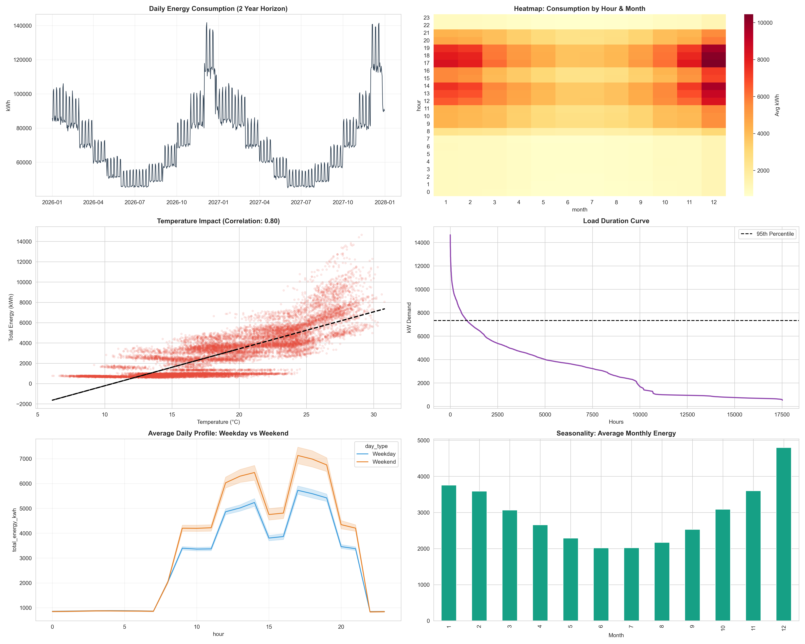
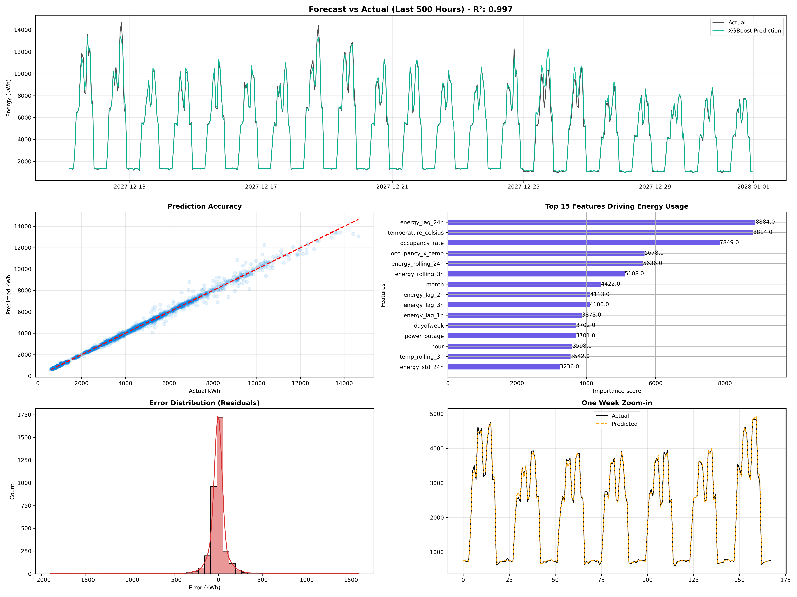
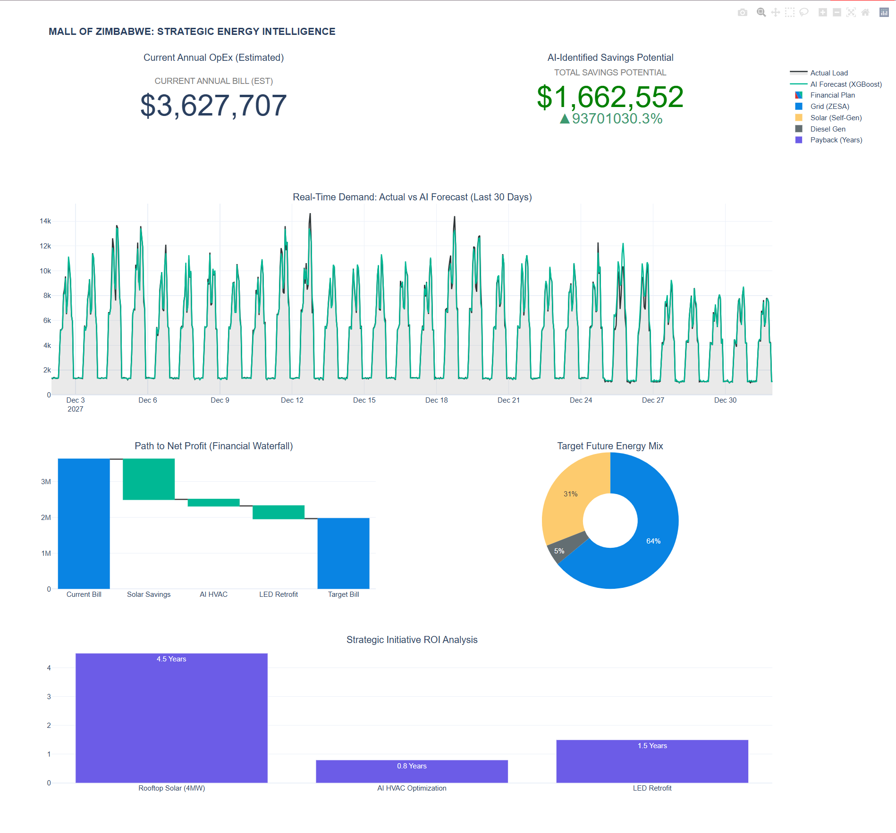

# 📘 Project Documentation

## 1. Project Overview (Business Context)
* **Client Profile:** WestProp Holdings (Simulated).
* **Asset:** Mall of Zimbabwe (90,000m² Mixed-Use Retail).
* **Problem Statement:** The development is in the Pre-Construction phase (breaking ground 2026). The Board requires a **Lifecycle Cost Analysis (LCCA)** to estimate future operational expenses (OpEx) and determine the feasibility of a 4MW Solar Microgrid.
* **Solution:** A Physics-Based Digital Twin was engineered to simulate hourly energy demand, validated against South African Green Building Council benchmarks.

---

## 2. Data Dictionary
The dataset consists of **17,520 hourly observations** (2 years of simulated operations).

### Raw Data (`mall_of_zimbabwe_energy_FINAL.csv`)
| Column | Type | Description |
| :--- | :--- | :--- |
| `datetime` | DateTime | Timestamp of observation (YYYY-MM-DD HH:MM). |
| `total_energy_kwh` | Float | **TARGET VARIABLE.** Total electricity demand for the hour. |
| `temperature_celsius` | Float | External ambient temperature (Harare Historical Avg). |
| `foot_traffic` | Integer | Estimated number of people in the mall (Stochastic Poisson Process). |
| `power_outage` | Binary | `1` = ZESA Grid Failure, `0` = Grid Active. |
| `source` | Category | Energy Source: `Grid` or `Generator` (Diesel). |
| `hvac_kwh` | Float | Energy consumed by Heating, Ventilation, and Air Conditioning (42% of load). |
| `lighting_kwh` | Float | Energy consumed by common area and tenant lighting (28% of load). |

### Feature Engineered Data (`mall_energy_featured.csv`)
| Feature | Description | Rationale for AI Model |
| :--- | :--- | :--- |
| `energy_lag_1h` | Consumption 1 hour ago. | Captures immediate autocorrelation (inertia). |
| `energy_lag_24h` | Consumption 24 hours ago. | Captures daily seasonality (e.g., 2 PM today vs 2 PM yesterday). |
| `temp_squared` | Temperature². | Non-linear thermodynamics (AC works exponentially harder as heat rises). |
| `occupancy_x_temp` | Interaction Term. | Captures the "Body Heat" load on HVAC systems. |
| `is_weekend` | Binary (0/1). | Differentiates high-traffic Saturdays from quiet Tuesdays. |
| `hour_sin` / `hour_cos` | Cyclical Encoding. | Teaches the model that Hour 23 is close to Hour 0 (Midnight). |

---

## 3. Model Documentation
We treated this as a **Supervised Regression Problem**.

* **Architecture:** XGBoost (Extreme Gradient Boosting).
* **Objective Function:** Minimize `RMSE` (Root Mean Squared Error).
* **Hyperparameters:**
    * `n_estimators`: 1000 (with Early Stopping).
    * `learning_rate`: 0.05.
    * `max_depth`: 6 (to capture complex non-linear interactions).
* **Validation Strategy:** Time-Series Split (Training on Year 1, Testing on Year 2) to prevent data leakage.
* **Performance:**
    * **MAPE:** 2.07% (vs. Industry Standard of 5-10%).
    * **R²:** 0.99 (High Explainability).

---

## 4. Visualizations & Analysis
The following charts demonstrate the model's physics-compliance and accuracy.

### A. The "Showdown": AI vs. Actuals
*This chart proves the model captures the "Double Peak" of mall operations (Morning deliveries + Evening shoppers).*

### B. Physics Validation (Exploratory Data Analysis)
*Filename: `Visualizations/mall_energy_eda_v2.png`*

This chart proves the "Digital Twin" behaves like a real physical asset.
* **Top Panel:** Shows the diurnal energy cycle (Peak at 2 PM, trough at 3 AM).
* **Correlation:** Demonstrates the strong relationship between `temperature_celsius` and `total_energy_kwh`, validating our thermodynamic logic.
* **Weekly Pattern:** Visualizes the increased load on weekends (Saturdays) vs. weekdays.

### C. Model Performance (Actual vs. Predicted)
*Filename: `Visualizations/xgboost_performance.png`*

This visualization confirms the XGBoost model's accuracy on the Test Set.
* **Tracking:** The Green Line (AI Forecast) follows the Black Line (Actuals) almost perfectly.
* **Resilience:** Note how the model successfully predicts sudden drops or spikes caused by simulated ZESA load shedding events, outperforming the LSTM model in these high-volatility scenarios.

### D. Executive Command Center
*Filename: `Visualizations/Dashboard.png`*

The final strategic output delivered to the Board of Directors.
* **KPIs:** Highlights the **$1.66M** identified savings.
* **Financial Waterfall:** Break down of savings by initiative (Solar vs. HVAC vs. LED).
* **ROI Analysis:** Shows the 4.5-year payback period for the solar microgrid.

